# Diagramas de classes

Cada diagrama aparece como imagem (PNG, em [`img/`](img/)) e traz o código [Mermaid](https://mermaid.js.org/) recolhido logo abaixo,
para editar ou para o GitHub renderizar. Para refazer as imagens a partir do Mermaid: `python docs/gerar_diagramas.py`.

## 1. Servidor: domínio, estados e criação

Factory Method, Builder, State e a hierarquia de atividades (Prototype, Visitor e Memento em `Activity`).

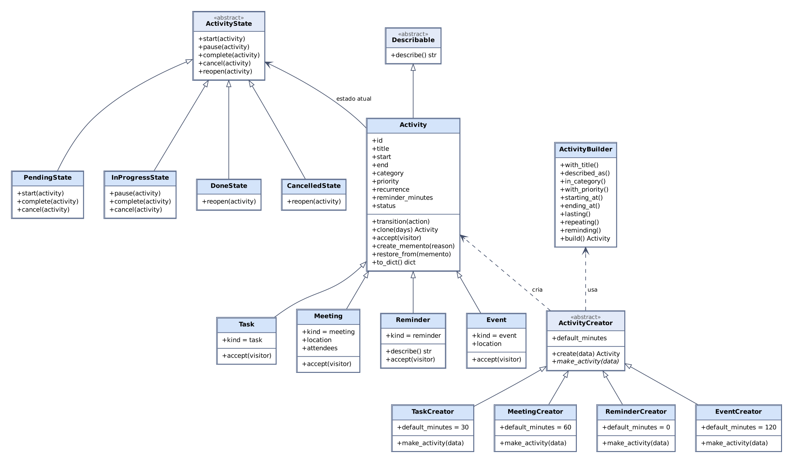

Código Mermaid

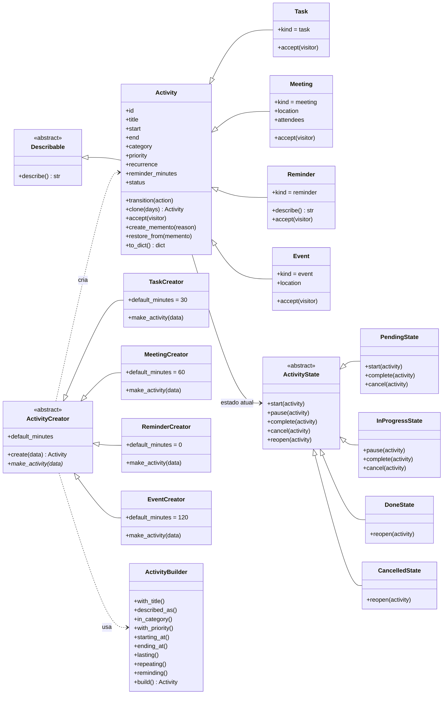
```mermaid
---
config:
  class:
    hideEmptyMembersBox: true
---
classDiagram
    direction LR
    class Describable {
        <<abstract>>
        +describe() str
    }
    class Activity {
        +id
        +title
        +start
        +end
        +category
        +priority
        +recurrence
        +reminder_minutes
        +status
        +transition(action)
        +clone(days) Activity
        +accept(visitor)
        +create_memento(reason)
        +restore_from(memento)
        +to_dict() dict
    }
    class Task {
        +kind = task
        +accept(visitor)
    }
    class Meeting {
        +kind = meeting
        +location
        +attendees
        +accept(visitor)
    }
    class Reminder {
        +kind = reminder
        +describe() str
        +accept(visitor)
    }
    class Event {
        +kind = event
        +location
        +accept(visitor)
    }
    Describable <|-- Activity
    Activity <|-- Task
    Activity <|-- Meeting
    Activity <|-- Reminder
    Activity <|-- Event

    class ActivityState {
        <<abstract>>
        +start(activity)
        +pause(activity)
        +complete(activity)
        +cancel(activity)
        +reopen(activity)
    }
    class PendingState {
        +start(activity)
        +complete(activity)
        +cancel(activity)
    }
    class InProgressState {
        +pause(activity)
        +complete(activity)
        +cancel(activity)
    }
    class DoneState {
        +reopen(activity)
    }
    class CancelledState {
        +reopen(activity)
    }
    ActivityState <|-- PendingState
    ActivityState <|-- InProgressState
    ActivityState <|-- DoneState
    ActivityState <|-- CancelledState
    Activity --> ActivityState : estado atual

    class ActivityCreator {
        <<abstract>>
        +default_minutes
        +create(data) Activity
        +make_activity(data)*
    }
    class TaskCreator {
        +default_minutes = 30
        +make_activity(data)
    }
    class MeetingCreator {
        +default_minutes = 60
        +make_activity(data)
    }
    class ReminderCreator {
        +default_minutes = 0
        +make_activity(data)
    }
    class EventCreator {
        +default_minutes = 120
        +make_activity(data)
    }
    ActivityCreator <|-- TaskCreator
    ActivityCreator <|-- MeetingCreator
    ActivityCreator <|-- ReminderCreator
    ActivityCreator <|-- EventCreator
    class ActivityBuilder {
        +with_title()
        +described_as()
        +in_category()
        +with_priority()
        +starting_at()
        +ending_at()
        +lasting()
        +repeating()
        +reminding()
        +build() Activity
    }
    ActivityCreator ..> ActivityBuilder : usa
    ActivityCreator ..> Activity : cria
```

## 2. Servidor: persistência, fachada e API

Singleton, Proxy, Observer, Facade e Memento.

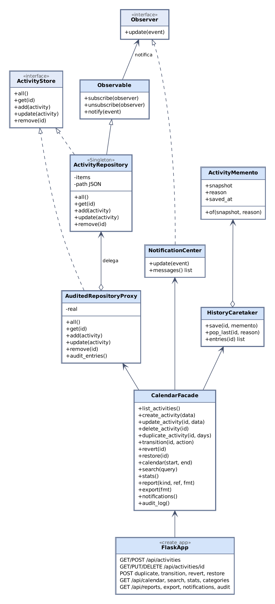

Código Mermaid

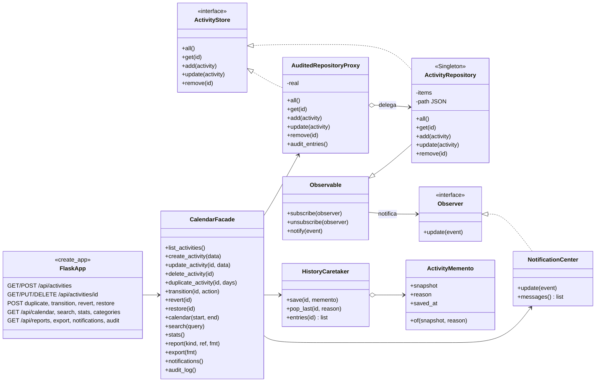
```mermaid
---
config:
  class:
    hideEmptyMembersBox: true
---
classDiagram
    direction LR
    class FlaskApp {
        <<create_app>>
        GET/POST /api/activities
        GET/PUT/DELETE /api/activities/id
        POST duplicate, transition, revert, restore
        GET /api/calendar, search, stats, categories
        GET /api/reports, export, notifications, audit
    }
    class CalendarFacade {
        +list_activities()
        +create_activity(data)
        +update_activity(id, data)
        +delete_activity(id)
        +duplicate_activity(id, days)
        +transition(id, action)
        +revert(id)
        +restore(id)
        +calendar(start, end)
        +search(query)
        +stats()
        +report(kind, ref, fmt)
        +export(fmt)
        +notifications()
        +audit_log()
    }
    FlaskApp --> CalendarFacade

    class ActivityStore {
        <<interface>>
        +all()
        +get(id)
        +add(activity)
        +update(activity)
        +remove(id)
    }
    class ActivityRepository {
        <<Singleton>>
        -items
        -path JSON
        +all()
        +get(id)
        +add(activity)
        +update(activity)
        +remove(id)
    }
    class AuditedRepositoryProxy {
        -real
        +all()
        +get(id)
        +add(activity)
        +update(activity)
        +remove(id)
        +audit_entries()
    }
    class Observable {
        +subscribe(observer)
        +unsubscribe(observer)
        +notify(event)
    }
    class Observer {
        <<interface>>
        +update(event)
    }
    class NotificationCenter {
        +update(event)
        +messages() list
    }
    ActivityStore <|.. ActivityRepository
    ActivityStore <|.. AuditedRepositoryProxy
    AuditedRepositoryProxy o--> ActivityRepository : delega
    Observable <|-- ActivityRepository
    Observer <|.. NotificationCenter
    Observable --> Observer : notifica
    CalendarFacade --> AuditedRepositoryProxy
    CalendarFacade --> NotificationCenter

    class HistoryCaretaker {
        +save(id, memento)
        +pop_last(id, reason)
        +entries(id) list
    }
    class ActivityMemento {
        +snapshot
        +reason
        +saved_at
        +of(snapshot, reason)
    }
    HistoryCaretaker o--> ActivityMemento
    CalendarFacade --> HistoryCaretaker
```

## 3. Servidor: validação em cadeia

Chain of Responsibility: cada regra é um elo que acumula erros e passa ao próximo.

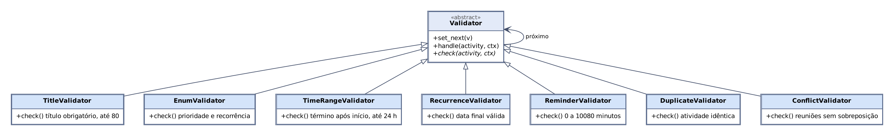

Código Mermaid

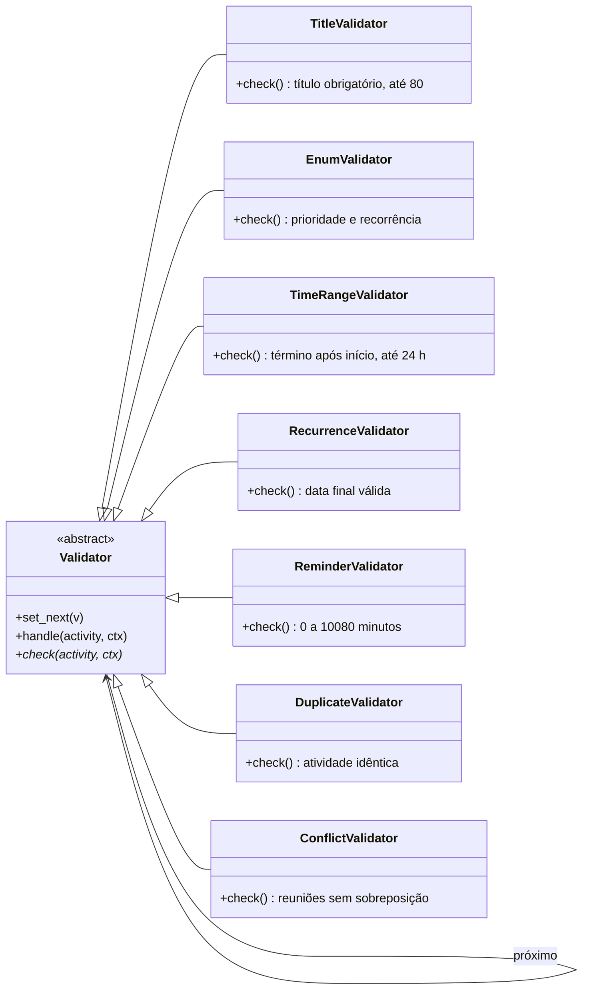
```mermaid
---
config:
  class:
    hideEmptyMembersBox: true
---
classDiagram
    direction LR
    class Validator {
        <<abstract>>
        +set_next(v)
        +handle(activity, ctx)
        +check(activity, ctx)*
    }
    class TitleValidator {
        +check() título obrigatório, até 80
    }
    class EnumValidator {
        +check() prioridade e recorrência
    }
    class TimeRangeValidator {
        +check() término após início, até 24 h
    }
    class RecurrenceValidator {
        +check() data final válida
    }
    class ReminderValidator {
        +check() 0 a 10080 minutos
    }
    class DuplicateValidator {
        +check() atividade idêntica
    }
    class ConflictValidator {
        +check() reuniões sem sobreposição
    }
    Validator <|-- TitleValidator
    Validator <|-- EnumValidator
    Validator <|-- TimeRangeValidator
    Validator <|-- RecurrenceValidator
    Validator <|-- ReminderValidator
    Validator <|-- DuplicateValidator
    Validator <|-- ConflictValidator
    Validator --> Validator : próximo

```

## 4. Servidor: linguagem de busca

Interpreter: a consulta vira uma árvore de expressões.

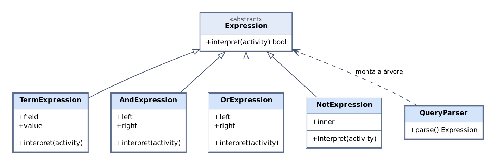

Código Mermaid

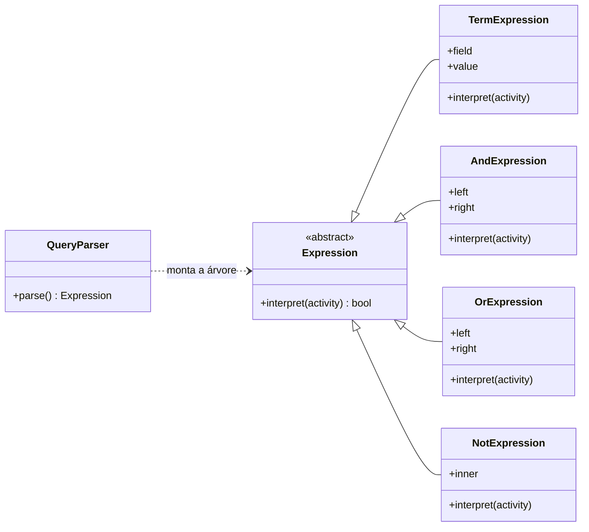
```mermaid
---
config:
  class:
    hideEmptyMembersBox: true
---
classDiagram
    direction LR
    class Expression {
        <<abstract>>
        +interpret(activity) bool
    }
    class TermExpression {
        +field
        +value
        +interpret(activity)
    }
    class AndExpression {
        +left
        +right
        +interpret(activity)
    }
    class OrExpression {
        +left
        +right
        +interpret(activity)
    }
    class NotExpression {
        +inner
        +interpret(activity)
    }
    class QueryParser {
        +parse() Expression
    }
    Expression <|-- TermExpression
    Expression <|-- AndExpression
    Expression <|-- OrExpression
    Expression <|-- NotExpression
    QueryParser ..> Expression : monta a árvore

```

## 5. Servidor: ordenação e iteração

Strategy para ordenar e Iterator para gerar datas e ocorrências recorrentes.

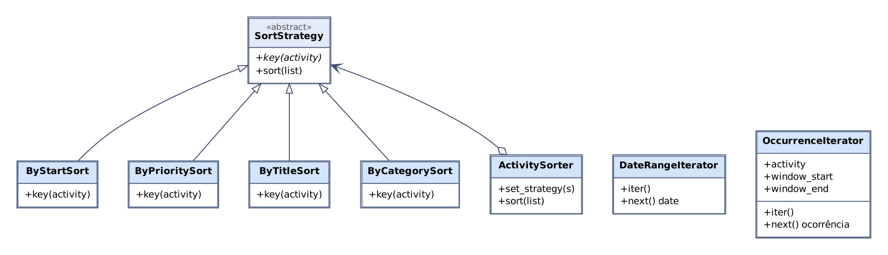

Código Mermaid

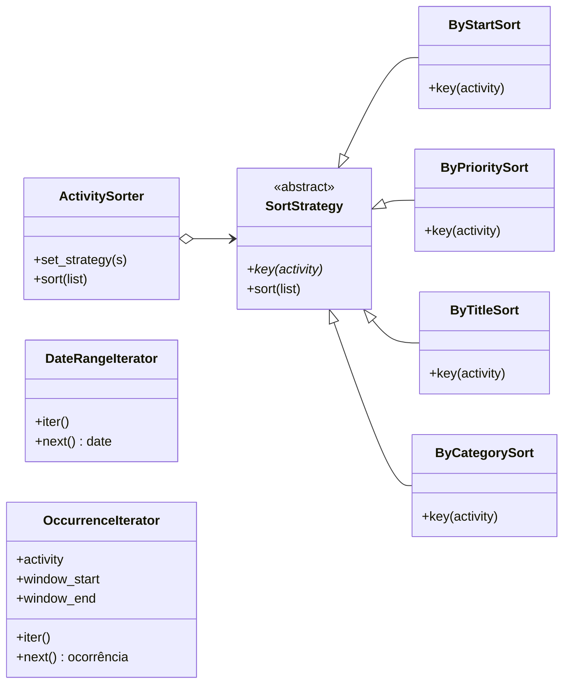
```mermaid
---
config:
  class:
    hideEmptyMembersBox: true
---
classDiagram
    direction LR
    class SortStrategy {
        <<abstract>>
        +key(activity)*
        +sort(list)
    }
    class ByStartSort {
        +key(activity)
    }
    class ByPrioritySort {
        +key(activity)
    }
    class ByTitleSort {
        +key(activity)
    }
    class ByCategorySort {
        +key(activity)
    }
    class ActivitySorter {
        +set_strategy(s)
        +sort(list)
    }
    SortStrategy <|-- ByStartSort
    SortStrategy <|-- ByPrioritySort
    SortStrategy <|-- ByTitleSort
    SortStrategy <|-- ByCategorySort
    ActivitySorter o--> SortStrategy

    class DateRangeIterator {
        +iter()
        +next() date
    }
    class OccurrenceIterator {
        +activity
        +window_start
        +window_end
        +iter()
        +next() ocorrência
    }
```

## 6. Servidor: categorias e visitantes

Composite para a árvore de categorias e Visitor para estatísticas e detalhes.

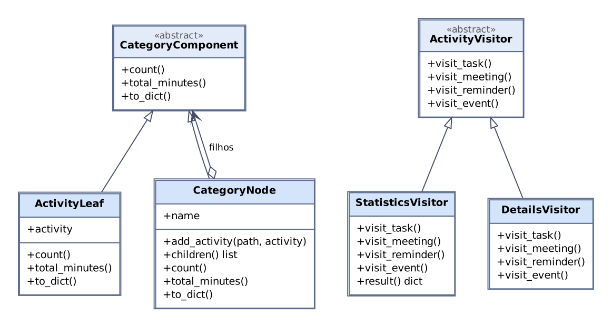

Código Mermaid

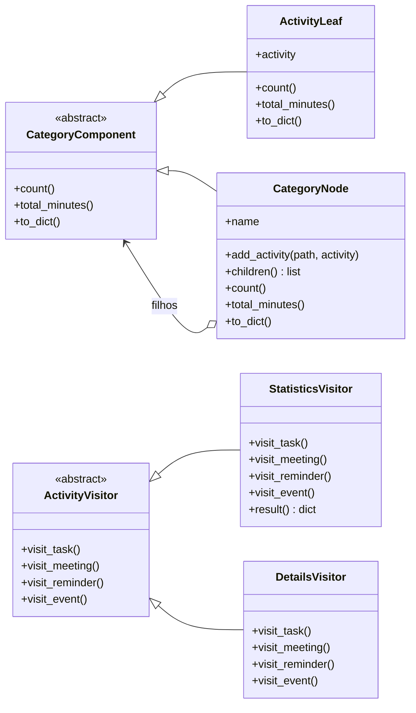
```mermaid
---
config:
  class:
    hideEmptyMembersBox: true
---
classDiagram
    direction LR
    class CategoryComponent {
        <<abstract>>
        +count()
        +total_minutes()
        +to_dict()
    }
    class ActivityLeaf {
        +activity
        +count()
        +total_minutes()
        +to_dict()
    }
    class CategoryNode {
        +name
        +add_activity(path, activity)
        +children() list
        +count()
        +total_minutes()
        +to_dict()
    }
    CategoryComponent <|-- ActivityLeaf
    CategoryComponent <|-- CategoryNode
    CategoryNode o--> CategoryComponent : filhos

    class ActivityVisitor {
        <<abstract>>
        +visit_task()
        +visit_meeting()
        +visit_reminder()
        +visit_event()
    }
    class StatisticsVisitor {
        +visit_task()
        +visit_meeting()
        +visit_reminder()
        +visit_event()
        +result() dict
    }
    class DetailsVisitor {
        +visit_task()
        +visit_meeting()
        +visit_reminder()
        +visit_event()
    }
    ActivityVisitor <|-- StatisticsVisitor
    ActivityVisitor <|-- DetailsVisitor

```

## 7. Servidor: decoradores do rótulo

Decorator: cada decorador acrescenta uma informação ao rótulo da atividade.

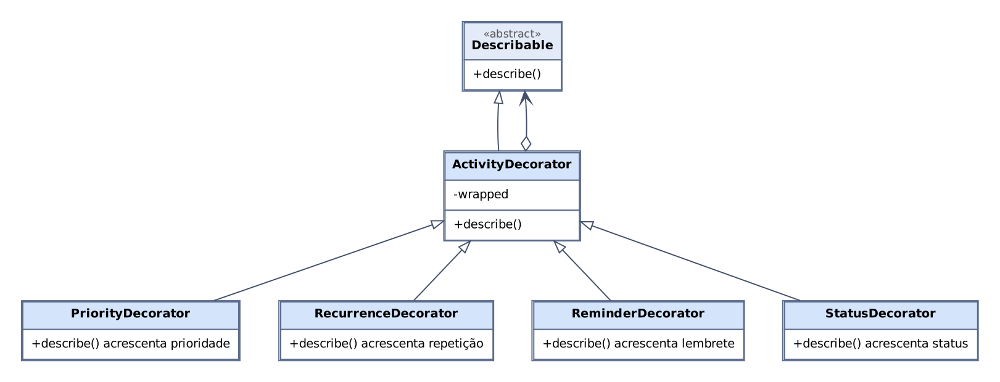

Código Mermaid

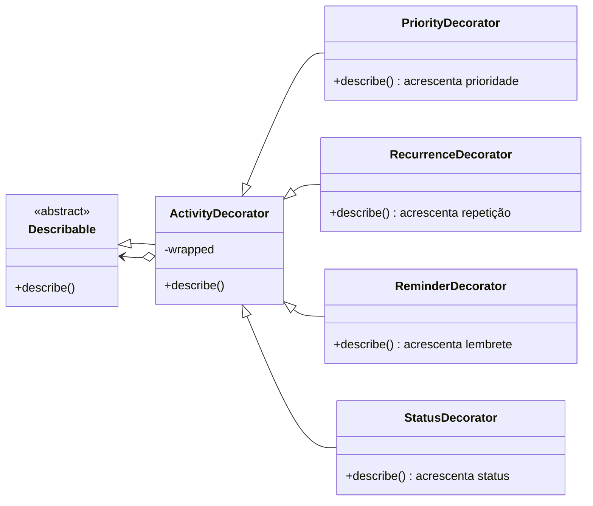
```mermaid
---
config:
  class:
    hideEmptyMembersBox: true
---
classDiagram
    direction LR
    class Describable {
        <<abstract>>
        +describe()
    }
    class ActivityDecorator {
        -wrapped
        +describe()
    }
    class PriorityDecorator {
        +describe() acrescenta prioridade
    }
    class RecurrenceDecorator {
        +describe() acrescenta repetição
    }
    class ReminderDecorator {
        +describe() acrescenta lembrete
    }
    class StatusDecorator {
        +describe() acrescenta status
    }
    Describable <|-- ActivityDecorator
    ActivityDecorator <|-- PriorityDecorator
    ActivityDecorator <|-- RecurrenceDecorator
    ActivityDecorator <|-- ReminderDecorator
    ActivityDecorator <|-- StatusDecorator
    ActivityDecorator o--> Describable

```

## 8. Servidor: exportação

Template Method (esqueleto do `export`) e Adapter (`Activity` para iCalendar).

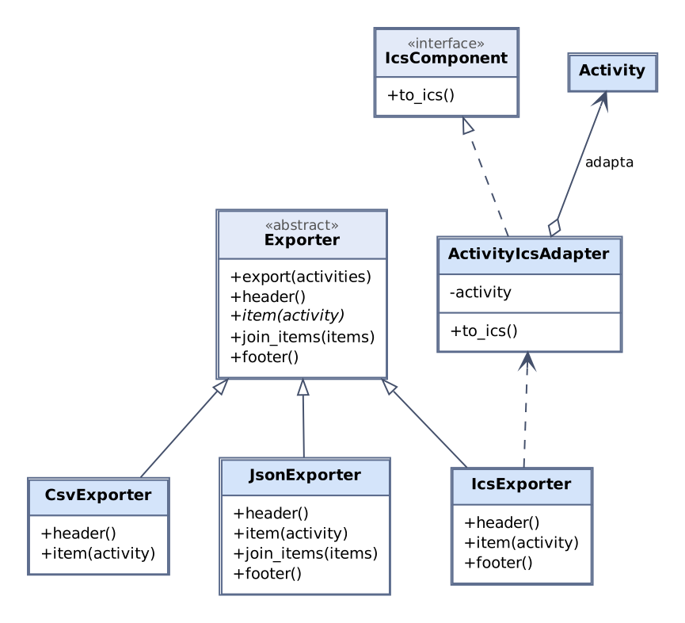

Código Mermaid

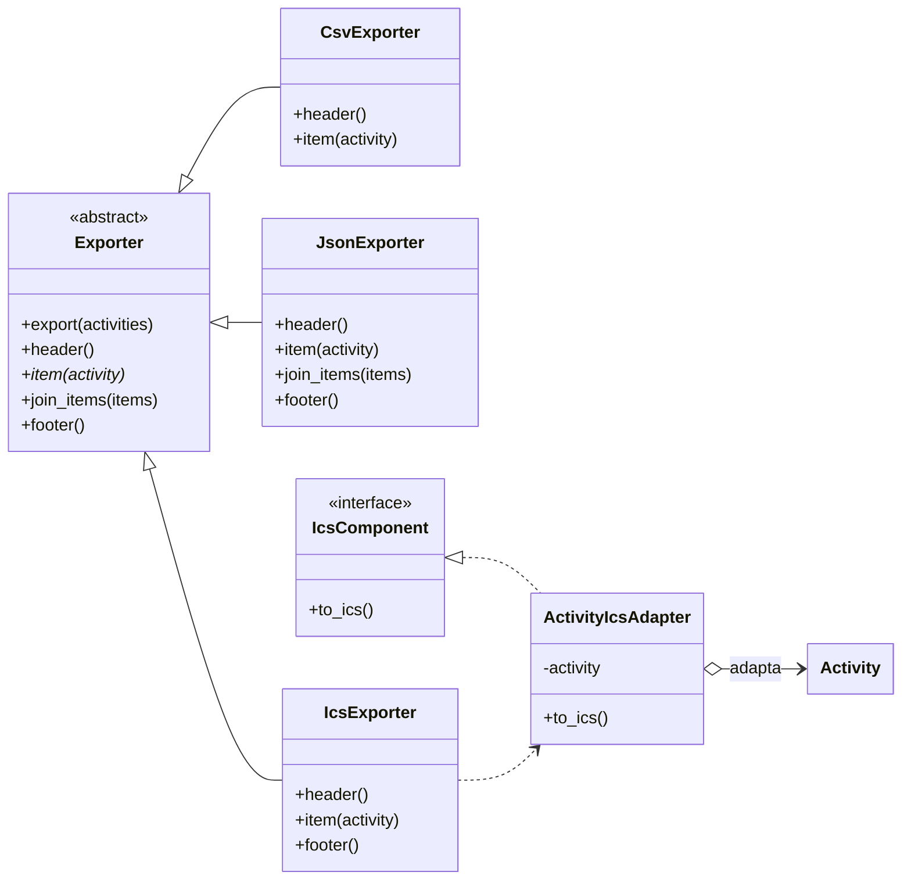
```mermaid
---
config:
  class:
    hideEmptyMembersBox: true
---
classDiagram
    direction LR
    class Exporter {
        <<abstract>>
        +export(activities)
        +header()
        +item(activity)*
        +join_items(items)
        +footer()
    }
    class CsvExporter {
        +header()
        +item(activity)
    }
    class JsonExporter {
        +header()
        +item(activity)
        +join_items(items)
        +footer()
    }
    class IcsExporter {
        +header()
        +item(activity)
        +footer()
    }
    class IcsComponent {
        <<interface>>
        +to_ics()
    }
    class ActivityIcsAdapter {
        -activity
        +to_ics()
    }
    Exporter <|-- CsvExporter
    Exporter <|-- JsonExporter
    Exporter <|-- IcsExporter
    IcsComponent <|.. ActivityIcsAdapter
    ActivityIcsAdapter o--> Activity : adapta
    IcsExporter ..> ActivityIcsAdapter

```

## 9. Servidor: relatórios

Bridge: o tipo de relatório e o formato de saída variam de forma independente.

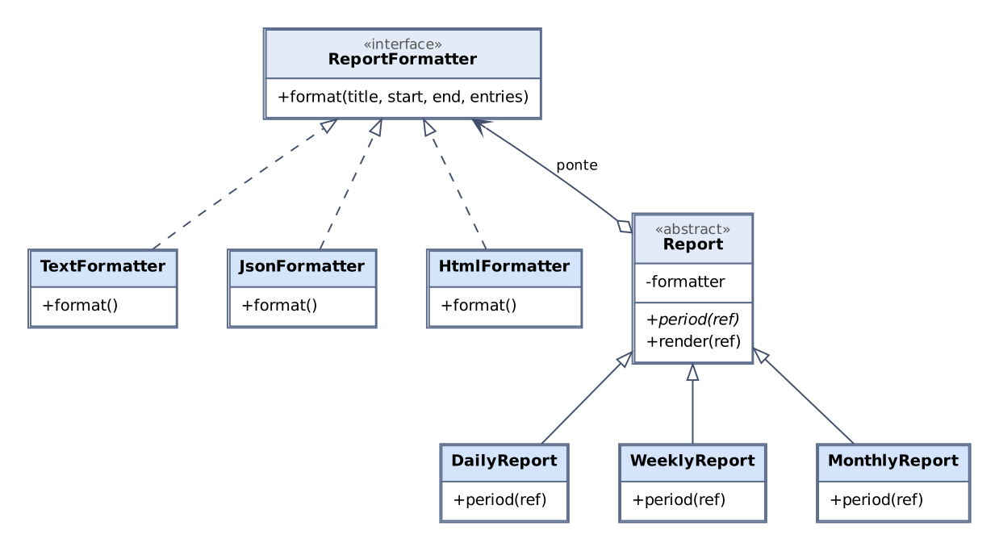

Código Mermaid

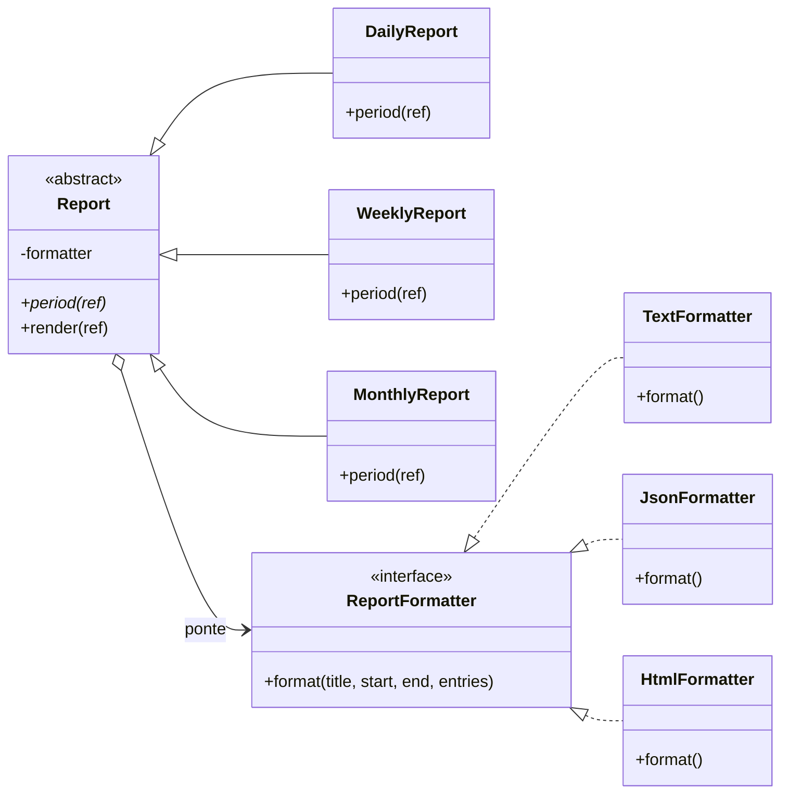
```mermaid
---
config:
  class:
    hideEmptyMembersBox: true
---
classDiagram
    direction LR
    class Report {
        <<abstract>>
        -formatter
        +period(ref)*
        +render(ref)
    }
    class DailyReport {
        +period(ref)
    }
    class WeeklyReport {
        +period(ref)
    }
    class MonthlyReport {
        +period(ref)
    }
    class ReportFormatter {
        <<interface>>
        +format(title, start, end, entries)
    }
    class TextFormatter {
        +format()
    }
    class JsonFormatter {
        +format()
    }
    class HtmlFormatter {
        +format()
    }
    Report <|-- DailyReport
    Report <|-- WeeklyReport
    Report <|-- MonthlyReport
    ReportFormatter <|.. TextFormatter
    ReportFormatter <|.. JsonFormatter
    ReportFormatter <|.. HtmlFormatter
    Report o--> ReportFormatter : ponte
```

## 10. Cliente: API, fachada, comandos e modelo

Proxy de cache, Facade, Command (desfazer e refazer) e Observer.

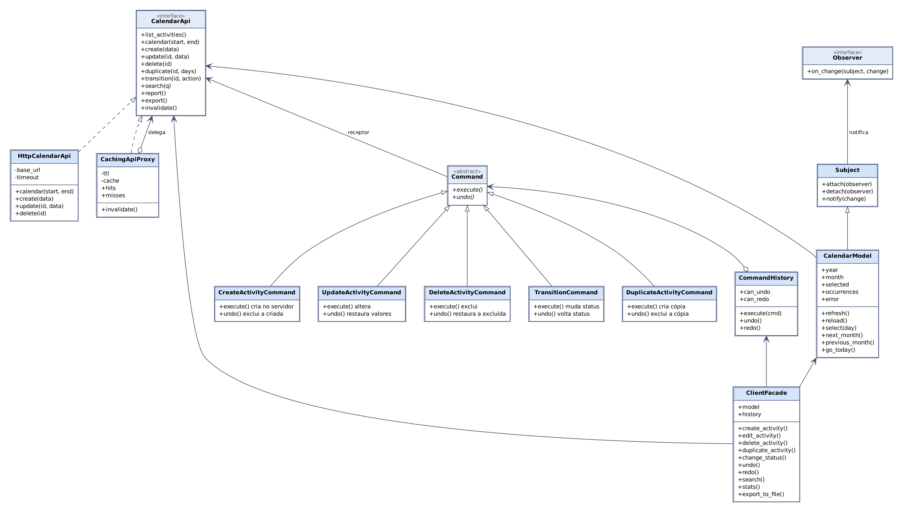

Código Mermaid

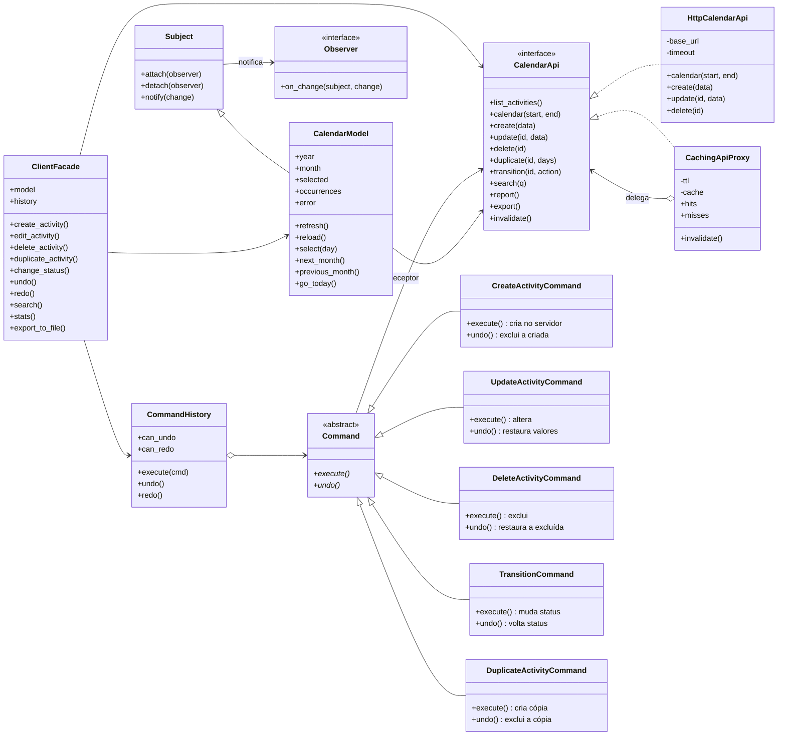
```mermaid
---
config:
  class:
    hideEmptyMembersBox: true
---
classDiagram
    direction LR
    class CalendarApi {
        <<interface>>
        +list_activities()
        +calendar(start, end)
        +create(data)
        +update(id, data)
        +delete(id)
        +duplicate(id, days)
        +transition(id, action)
        +search(q)
        +report()
        +export()
        +invalidate()
    }
    class HttpCalendarApi {
        -base_url
        -timeout
        +calendar(start, end)
        +create(data)
        +update(id, data)
        +delete(id)
    }
    class CachingApiProxy {
        -ttl
        -cache
        +hits
        +misses
        +invalidate()
    }
    CalendarApi <|.. HttpCalendarApi
    CalendarApi <|.. CachingApiProxy
    CachingApiProxy o--> CalendarApi : delega

    class ClientFacade {
        +model
        +history
        +create_activity()
        +edit_activity()
        +delete_activity()
        +duplicate_activity()
        +change_status()
        +undo()
        +redo()
        +search()
        +stats()
        +export_to_file()
    }
    class Command {
        <<abstract>>
        +execute()*
        +undo()*
    }
    class CreateActivityCommand {
        +execute() cria no servidor
        +undo() exclui a criada
    }
    class UpdateActivityCommand {
        +execute() altera
        +undo() restaura valores
    }
    class DeleteActivityCommand {
        +execute() exclui
        +undo() restaura a excluída
    }
    class TransitionCommand {
        +execute() muda status
        +undo() volta status
    }
    class DuplicateActivityCommand {
        +execute() cria cópia
        +undo() exclui a cópia
    }
    Command <|-- CreateActivityCommand
    Command <|-- UpdateActivityCommand
    Command <|-- DeleteActivityCommand
    Command <|-- TransitionCommand
    Command <|-- DuplicateActivityCommand
    class CommandHistory {
        +can_undo
        +can_redo
        +execute(cmd)
        +undo()
        +redo()
    }
    CommandHistory o--> Command
    ClientFacade --> CommandHistory
    ClientFacade --> CalendarApi
    Command --> CalendarApi : receptor

    class Subject {
        +attach(observer)
        +detach(observer)
        +notify(change)
    }
    class Observer {
        <<interface>>
        +on_change(subject, change)
    }
    class CalendarModel {
        +year
        +month
        +selected
        +occurrences
        +error
        +refresh()
        +reload()
        +select(day)
        +next_month()
        +previous_month()
        +go_today()
    }
    Subject <|-- CalendarModel
    Subject --> Observer : notifica
    ClientFacade --> CalendarModel
    CalendarModel --> CalendarApi
```

## 11. Cliente: janela, mediador e estilos

Observer nas telas, Mediator no formulário e Flyweight nos estilos das atividades.

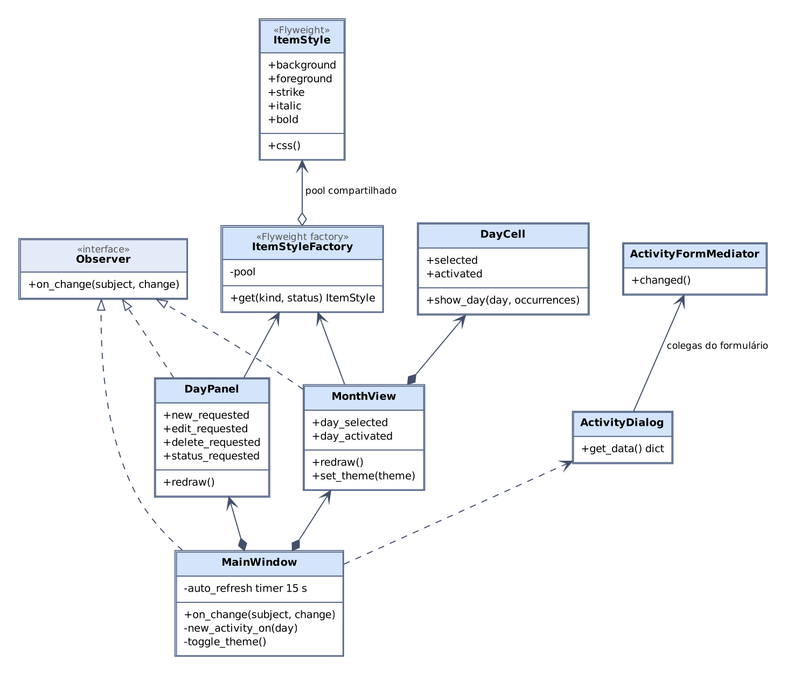

Código Mermaid

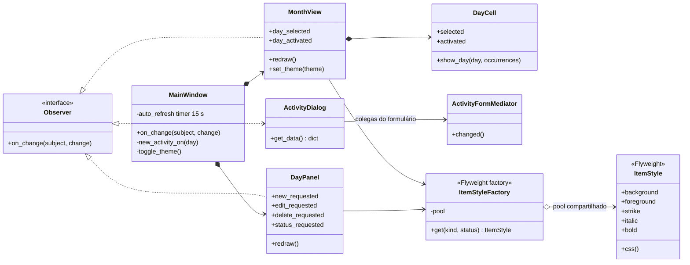
```mermaid
---
config:
  class:
    hideEmptyMembersBox: true
---
classDiagram
    direction LR
    class Observer {
        <<interface>>
        +on_change(subject, change)
    }
    class MainWindow {
        -auto_refresh timer 15 s
        +on_change(subject, change)
        -new_activity_on(day)
        -toggle_theme()
    }
    class MonthView {
        +day_selected
        +day_activated
        +redraw()
        +set_theme(theme)
    }
    class DayCell {
        +selected
        +activated
        +show_day(day, occurrences)
    }
    class DayPanel {
        +new_requested
        +edit_requested
        +delete_requested
        +status_requested
        +redraw()
    }
    class ActivityDialog {
        +get_data() dict
    }
    class ActivityFormMediator {
        +changed()
    }
    Observer <|.. MainWindow
    Observer <|.. MonthView
    Observer <|.. DayPanel
    MainWindow *--> MonthView
    MainWindow *--> DayPanel
    MonthView *--> DayCell
    MainWindow ..> ActivityDialog
    ActivityDialog --> ActivityFormMediator : colegas do formulário

    class ItemStyleFactory {
        <<Flyweight factory>>
        -pool
        +get(kind, status) ItemStyle
    }
    class ItemStyle {
        <<Flyweight>>
        +background
        +foreground
        +strike
        +italic
        +bold
        +css()
    }
    ItemStyleFactory o--> ItemStyle : pool compartilhado
    MonthView --> ItemStyleFactory
    DayPanel --> ItemStyleFactory
```

## 12. Cliente: temas claro e escuro

Abstract Factory: cada tema cria a família completa de paleta, botões e células.

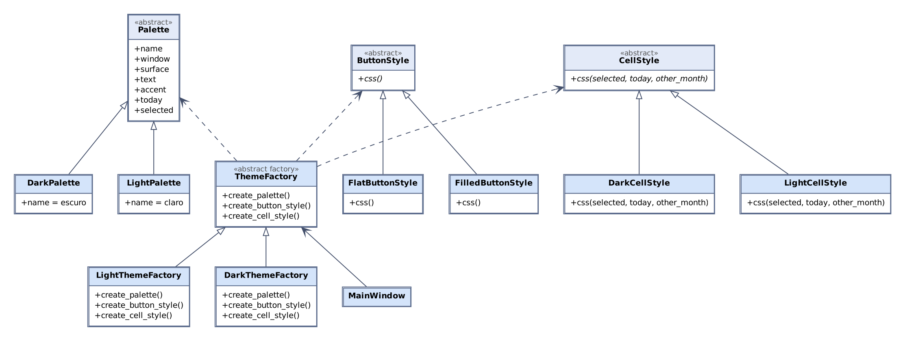

Código Mermaid

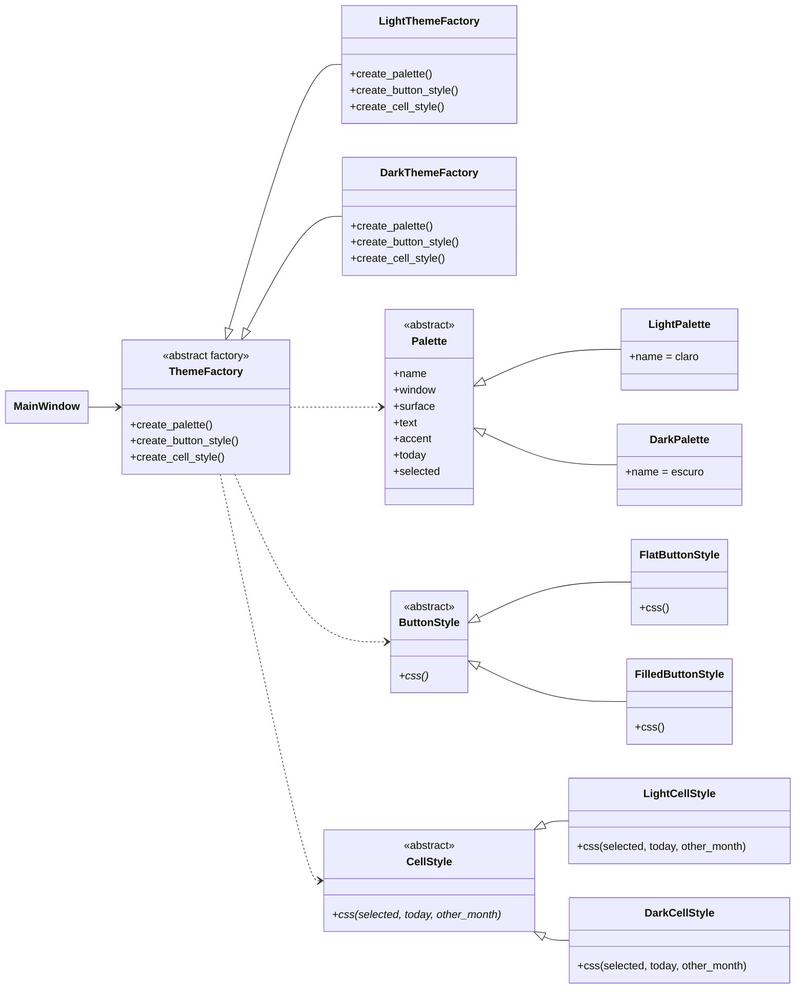
```mermaid
---
config:
  class:
    hideEmptyMembersBox: true
---
classDiagram
    direction LR
    class ThemeFactory {
        <<abstract factory>>
        +create_palette()
        +create_button_style()
        +create_cell_style()
    }
    class LightThemeFactory {
        +create_palette()
        +create_button_style()
        +create_cell_style()
    }
    class DarkThemeFactory {
        +create_palette()
        +create_button_style()
        +create_cell_style()
    }
    class Palette {
        <<abstract>>
        +name
        +window
        +surface
        +text
        +accent
        +today
        +selected
    }
    class LightPalette {
        +name = claro
    }
    class DarkPalette {
        +name = escuro
    }
    class ButtonStyle {
        <<abstract>>
        +css()*
    }
    class FlatButtonStyle {
        +css()
    }
    class FilledButtonStyle {
        +css()
    }
    class CellStyle {
        <<abstract>>
        +css(selected, today, other_month)*
    }
    class LightCellStyle {
        +css(selected, today, other_month)
    }
    class DarkCellStyle {
        +css(selected, today, other_month)
    }
    ThemeFactory <|-- LightThemeFactory
    ThemeFactory <|-- DarkThemeFactory
    Palette <|-- LightPalette
    Palette <|-- DarkPalette
    ButtonStyle <|-- FlatButtonStyle
    ButtonStyle <|-- FilledButtonStyle
    CellStyle <|-- LightCellStyle
    CellStyle <|-- DarkCellStyle
    ThemeFactory ..> Palette
    ThemeFactory ..> ButtonStyle
    ThemeFactory ..> CellStyle
    MainWindow --> ThemeFactory

```

